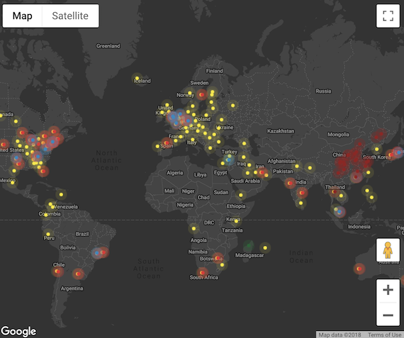

<div align="center">
  <a href="https://github.com/webpack/webpack">
    
  </a>
</div>

# jsdelivr-cdn-webpack-plugin

[](https://www.npmjs.com/package/jsdelivr-cdn-webpack-plugin) [](https://travis-ci.org/sparkboom/jsdelivr-cdn-webpack-plugin) [](https://codecov.io/gh/sparkboom/jsdelivr-cdn-webpack-plugin?branch=master) [](https://david-dm.org/sparkboom/jsdelivr-cdn-webpack-plugin) [](https://github.com/sindresorhus/xo)

This plugin extracts out your chosen dependencies from your build, and replaces them with a Script tag in your output html file referencing your desired package version in the [JSDelivr CDN network][jsdelivr]. This plugin works alongside [HtmlWebpackPlugin][htmlwpp].

## Why is this cool?

Do you manage your large dependencies via npm or yarn, or insert a script tag in your html template?

Using `jsdelivr-cdn-webpack-plugin` you get the best of both worlds. You can manage your package versions using your favourite package management tool, but leverage the power of JSDeliver network, your browser and the web to cache commonly used dependencies making your site start faster.

[JSDelivr][jsdelivr] serves files from their [large distributed network][jsdnw]



## Requirements

This module requires a minimum of Node v6.9.0 and Webpack v4.0.0.

## Install

```sh
npm i --save-dev jsdelivr-cdn-webpack-plugin html-webpack-plugin
```

```sh
yarn add jsdelivr-cdn-webpack-plugin html-webpack-plugin --dev
```

Use your favourite libraries such as `React`

**app.js**

```js
import React from 'react';
import PropTypes from 'prop-types';
import _ from 'lodash';

// ... do react stuff
```

Then add the plugin to your `webpack` config. For example:

**webpack.config.js**

```js
// Example Webpack configuration
const HtmlWebpackPlugin = require('html-webpack-plugin');
const JSDelivrCDNWebpackPlugin = require('jsdelivr-cdn-webpack-plugin');

module.exports = {
    ...
    plugins : [
        HtmlWebpackPlugin({
            title: 'My App',
            filename: 'dist/index.html'
        }),
        JSDelivrCDNWebpackPlugin({
            env: 'production',
            include: ['react', 'prop-types', 'lodash']
        }),
    ]
};
```

And run `webpack` via your preferred method.

Your generated `index.html` should look like

```html
<!-- Example Generated HTML Output -->
<!DOCTYPE html>
<html lang="en">
<head>
    <meta charset="utf-8">
    <title>My App</title>
</head>
<body>
    <div id="app"></div>
    <script type="text/javascript" src="https://cdn.jsdelivr.net/npm/react@16.5.2/react.min.js"></script>
    <script type="text/javascript" src="https://cdn.jsdelivr.net/npm/prop-types@15.6.2/prop-types.min.js"></script>
    <script type="text/javascript" src="https://cdn.jsdelivr.net/npm/lodash@4.17.11/lodash.min.js"></script>
    <script type="text/javascript" src="myapp-3e34c5eda4a2e99d1c0d.js"></script></body>
</html>
```

## Options

### `include`

### `env`

## Resources

- [GitHub - HtmlWebpackPlugin][ghhtmlwpp]

[htmlwpp]: https://webpack.js.org/plugins/html-webpack-plugin/
[ghhtmlwpp]: https://github.com/jantimon/html-webpack-plugin
[jsdelivr]: https://www.jsdelivr.com/
[jsdnw]: https://www.jsdelivr.com/network

## License

MIT © [Matthew McLeod](http://sparkboom.com)
